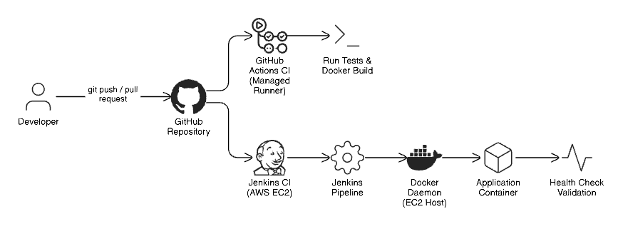

# CI Architecture

The CI architecture consists of the following components:
- GitHub repository as the source of truth
- Jenkins for self-hosted CI execution
- GitHub Actions for managed CI execution
- Docker for build and runtime consistency

All pipelines follow the same logical flow: checkout → build → test → validate.  
Only the CI execution environment changes between Jenkins and GitHub Actions.

---