# Screenshots

**01-app-local-run**

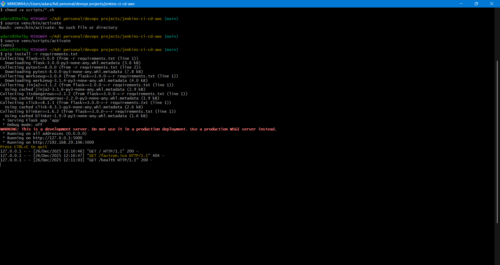

**02-app-localhost**

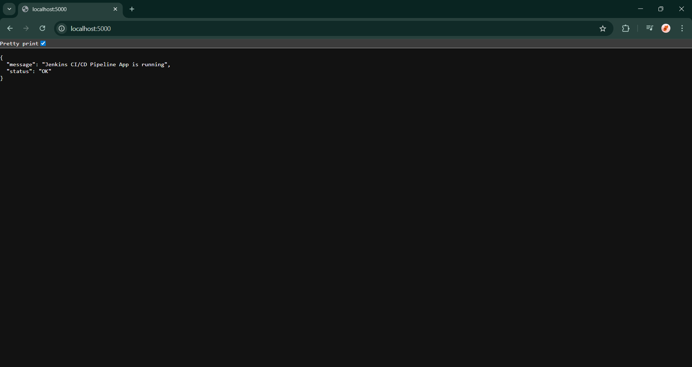

**03-app-health-test**

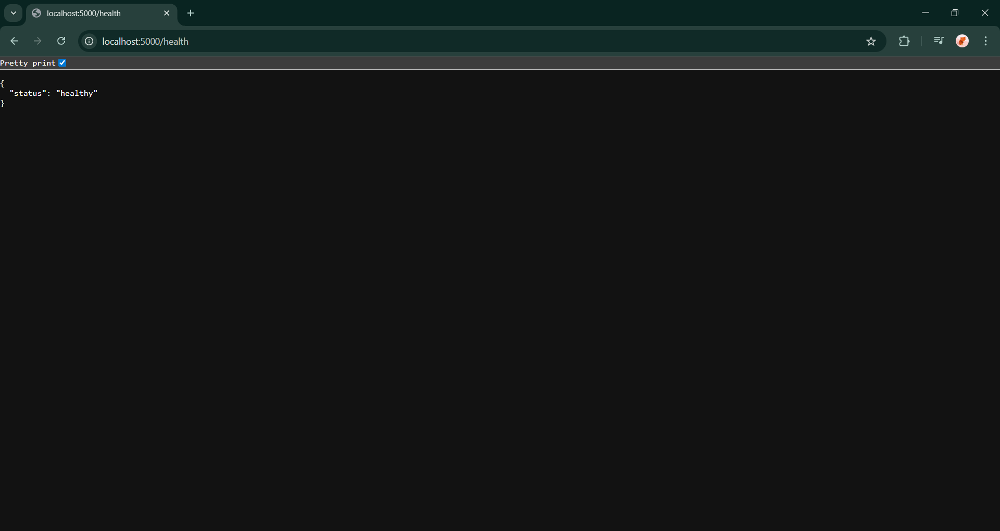

**04-app-testing**

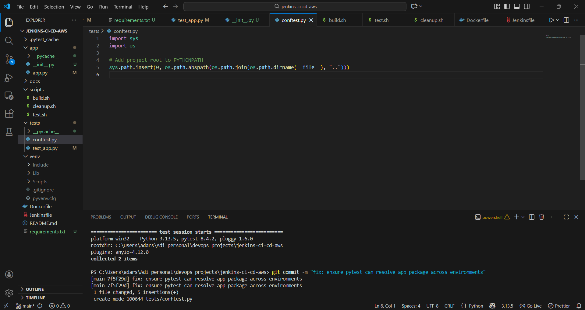

**05-docker-build-&-run**

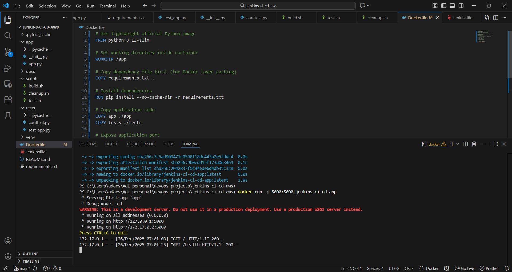

**06-docker-curl**

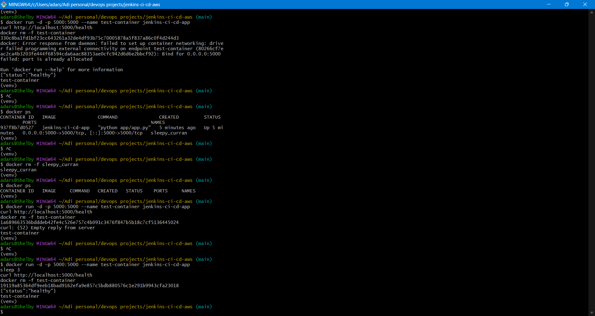

**07-docker-image**

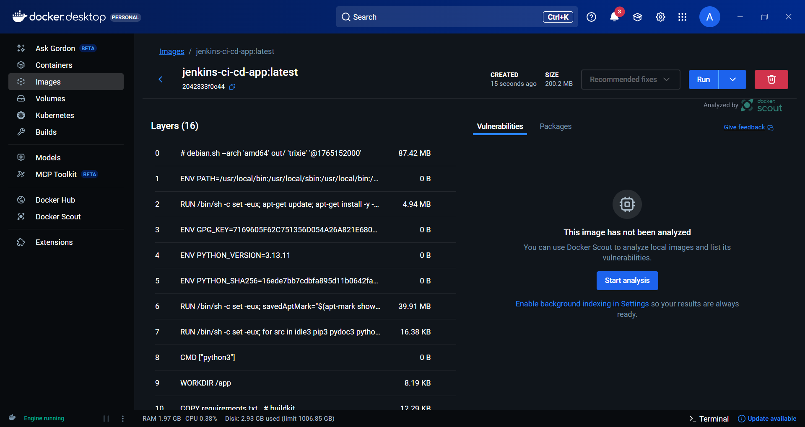

**08-EC2-bash-login**

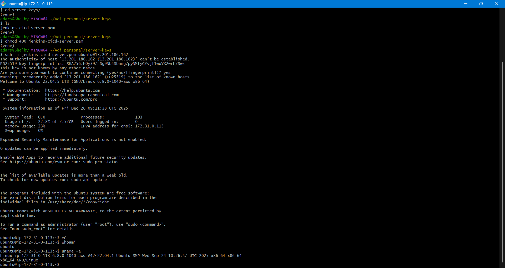

**09-EC2-docker-running**

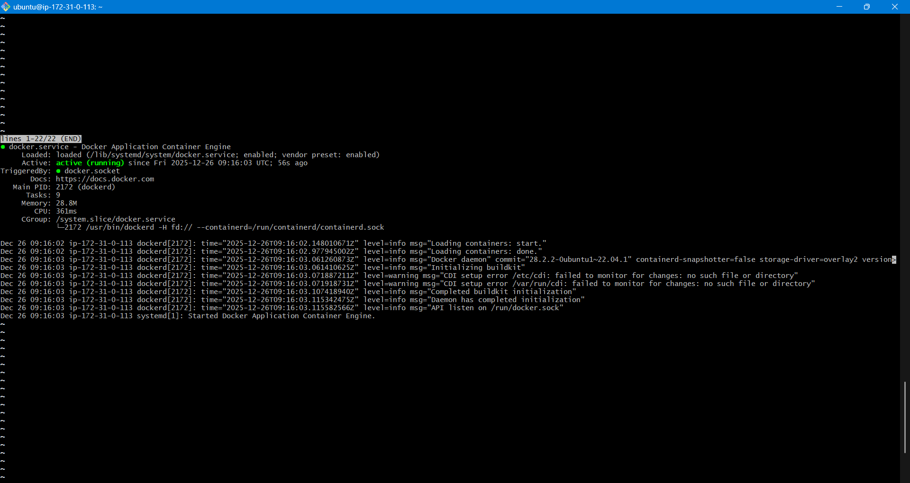

**10-docker-ps**

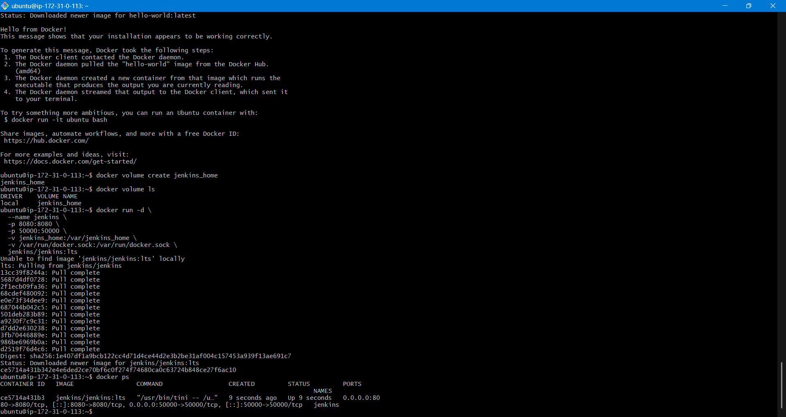

**11-jenkins-build-output**

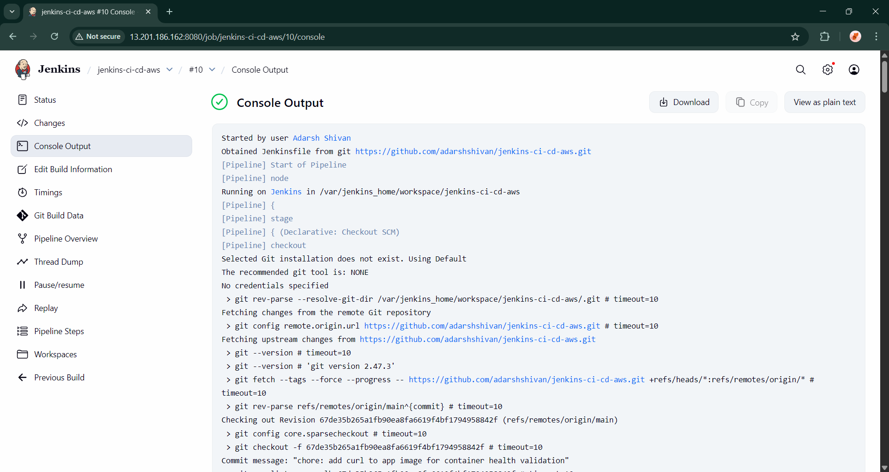

**12-jenkins-build-success**

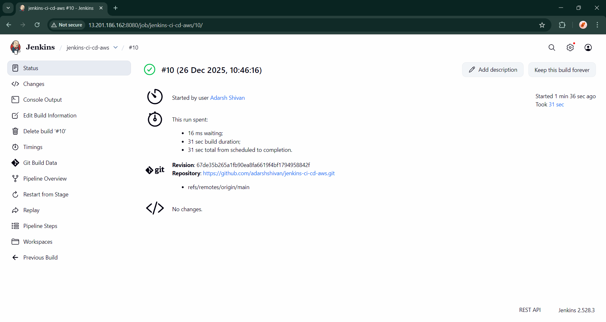

**13-github-action-pipeline**

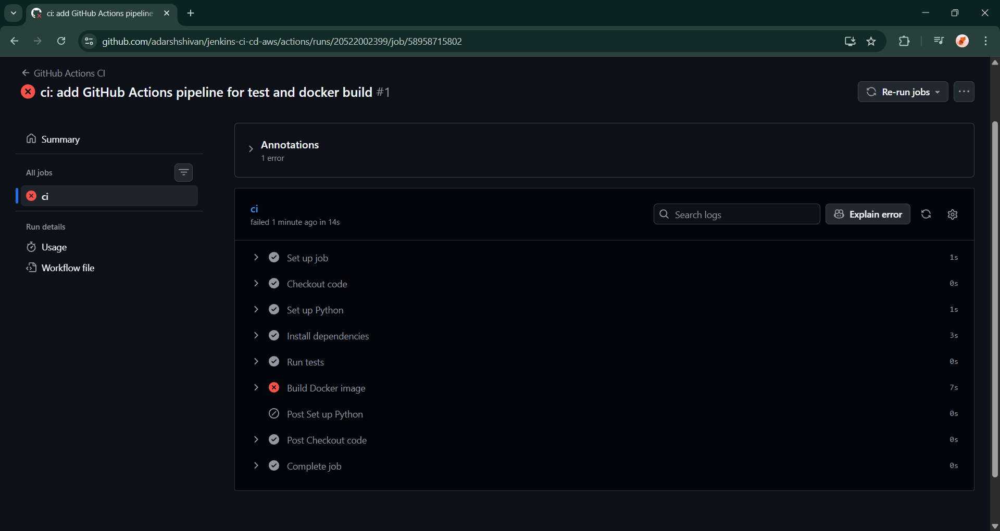

**14-fixed-docker-build**

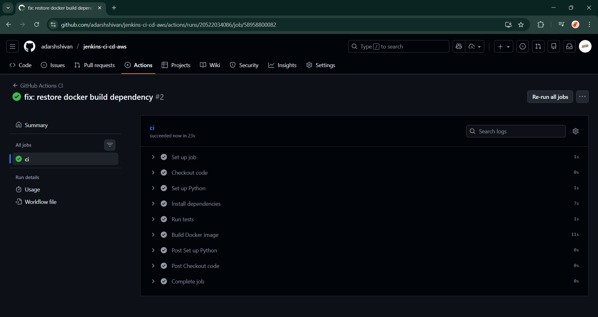

---
